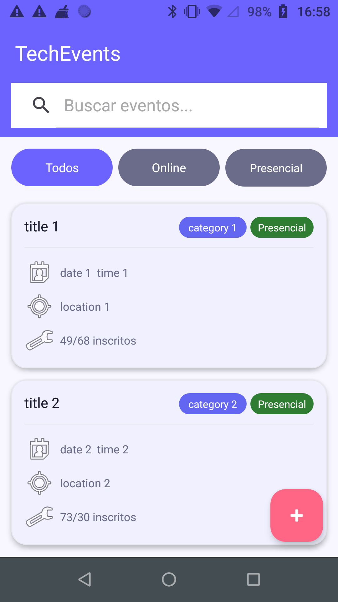
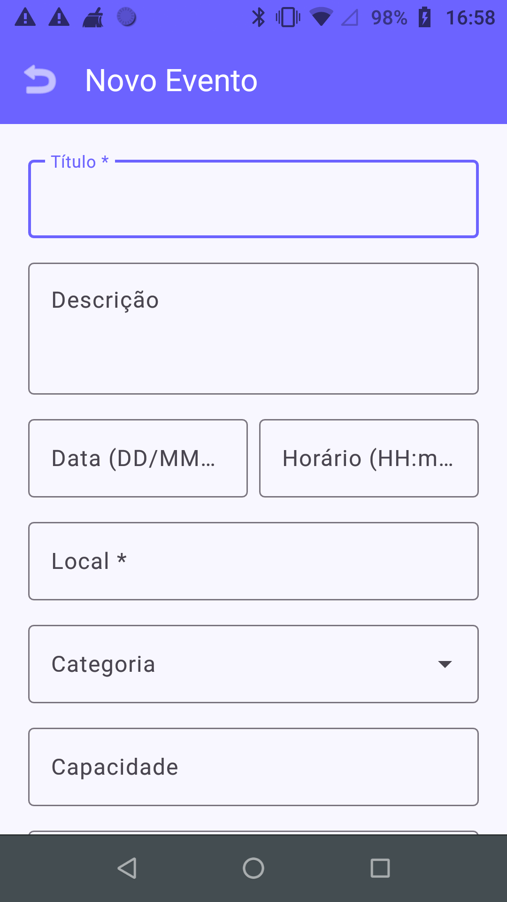

# 📅 TechEvents


[](https://github.com/TallesGuerra/TechEvents/releases/download/v1.0.0/app-debug.apk)

**Android event agenda app built with Kotlin and XML Views to create, browse, edit, and delete personal tech events, with search, category filters, and infinite scroll pagination.**

---

## 📥 Download

| Version | Date | Link |
|---------|------|------|
| v1.0.0  | 2026 | [Download APK](https://github.com/TallesGuerra/TechEvents/releases/download/v1.0.0/app-debug.apk) |

> Requires Android 7.0+ (API 24). Enable **"Install from unknown sources"** in device settings before installing.

---

## 📸 Screenshots

| Home | Novo Evento |
|------|-------------|
|  |  |

---

## 📱 Features

- ✅ Splash screen with timed navigation
- ✅ Event list with pagination (infinite scroll)
- ✅ Search events by keyword
- ✅ Filter by category and online/in-person
- ✅ Event detail screen with external link support
- ✅ Create new events with full form validation
- ✅ Edit existing events with pre-filled form
- ✅ Delete events with confirmation dialog
- ✅ Full CRUD via REST API (MockAPI.io)
- ✅ Reactive UI state with `UiState` sealed class (Loading / Success / Error / Empty)
- ✅ Clean MVVM + Repository + UseCase architecture (no DI framework)

---

## 🏗️ Architecture

```
com.example.techevents/
│
├── 📱 MainActivity.kt
│
├── 🌐 data/
│   ├── api/
│   │   ├── RetrofitClient.kt           # Retrofit singleton with OkHttp + logging
│   │   └── TechEventsApi.kt            # GET, POST, PUT, DELETE endpoints
│   ├── dto/
│   │   ├── MeetupEventDto.kt           # EventDto — flat data transfer object
│   │   ├── MeetupResponse.kt           # typealias TechEventsResponse = List<EventDto>
│   │   └── CreateEventRequest.kt       # Request body for POST and PUT
│   └── repository/
│       ├── Result.kt                   # Sealed class: Success / Error
│       └── EventRepositoryImpl.kt      # DTO → domain mapping + error handling
│
├── 🧩 domain/
│   ├── model/
│   │   └── Event.kt                    # Pure domain model (no Android deps)
│   ├── repository/
│   │   └── EventRepository.kt          # Repository interface (contract)
│   └── usecase/
│       ├── GetEventsUseCase.kt
│       ├── GetEventDetailUseCase.kt
│       ├── CreateEventUseCase.kt
│       ├── UpdateEventUseCase.kt
│       └── DeleteEventUseCase.kt
│
├── 🖼️ presentation/
│   ├── state/
│   │   └── UiState.kt                  # Sealed class: Loading / Success / Error / Empty
│   ├── viewmodel/
│   │   ├── EventListViewModel.kt       # Pagination, search, category & online filters
│   │   ├── EventDetailViewModel.kt
│   │   ├── CreateEventViewModel.kt
│   │   └── EditEventViewModel.kt       # Load + update + delete states
│   └── ui/
│       ├── splash/
│       │   └── SplashActivity.kt
│       ├── eventlist/
│       │   ├── EventListActivity.kt    # RecyclerView + FAB + scroll listener
│       │   └── EventAdapter.kt         # ListAdapter with DiffUtil
│       ├── eventdetail/
│       │   └── EventDetailActivity.kt  # Detail + Edit button via ActivityResultLauncher
│       ├── createevent/
│       │   └── CreateEventActivity.kt
│       └── editevent/
│           └── EditEventActivity.kt    # Pre-filled form + delete confirmation
│
└── 🛠️ utils/
    └── Extensions.kt                   # showToast extension
```

### Design Principles Applied

- **MVVM Architecture** — Activities hold no business logic; ViewModels expose `LiveData` state
- **Repository Pattern** — single source of truth; `EventRepositoryImpl` handles API calls and DTO→domain mapping
- **Clean Architecture layers** — `data` → `domain` → `presentation` with strict one-way dependency
- **UseCases** — each operation is a dedicated class with a single `invoke` operator
- **Manual DI** — no Hilt/Koin; dependencies constructed manually via `ViewModelProvider.Factory`
- **Sealed classes** — `UiState` and `Result` make all states explicit and exhaustive

---

## 🔧 Technologies

| Technology              | Version  | Description                                      |
|-------------------------|----------|--------------------------------------------------|
| **Kotlin**              | 2.0.21   | Modern, concise Android language                 |
| **XML Views**           | —        | Traditional Android UI with `ViewBinding`        |
| **Material Components** | 1.13.0   | Buttons, Cards, FAB, TextInputLayout             |
| **RecyclerView**        | 1.3.2    | Efficient list rendering with `ListAdapter`      |
| **Retrofit**            | 2.11.0   | Type-safe HTTP client for REST APIs              |
| **OkHttp**              | 4.12.0   | HTTP layer + logging interceptor                 |
| **Gson Converter**      | 2.11.0   | JSON deserialization for Retrofit                |
| **Lifecycle ViewModel** | 2.8.7    | Lifecycle-aware state holder                     |
| **LiveData**            | 2.8.7    | Observable data holder for UI state              |
| **Coroutines**          | 1.9.0    | Asynchronous and concurrent programming          |
| **MockAPI.io**          | —        | Free REST mock backend with full CRUD support    |
| **Android SDK**         | 24+      | Compatible with 95%+ of active devices           |

---

## 🚀 Getting Started

### Prerequisites

- Android Studio Hedgehog (2023.1.1) or higher
- JDK 17+
- Android SDK 36
- Physical device or emulator with API 24+

### Steps

1. **Clone the repository**
   ```bash
   git clone https://github.com/TallesGuerra/TechEvents.git
   cd TechEvents
   ```

2. **Open in Android Studio**
   - File → Open → Select the project folder

3. **Sync dependencies**
   - Gradle will sync automatically on first open

4. **Run the app**
   - Click **Run** ▶️ or press `Shift + F10`
   - Select a device or emulator

> No API keys or environment setup required — the app uses MockAPI.io with a public endpoint.

---

## 💡 Concepts Demonstrated

- **MVVM** with `LiveData` and `viewModelScope` for lifecycle-aware, reactive state
- **Repository Pattern** with interface segregation — `EventRepository` interface in `domain`, implementation in `data`
- **UseCase layer** — each operation (`GetEvents`, `CreateEvent`, `UpdateEvent`, `DeleteEvent`) is an isolated, testable class
- **Sealed classes** — `UiState<T>` (Loading, Success, Error, Empty) and `Result<T>` (Success, Error) for exhaustive state handling
- **ListAdapter + DiffUtil** — efficient diffing and smooth animations in `RecyclerView`
- **Pagination** — accumulated list pattern with `canLoadMore` flag and `RecyclerView.OnScrollListener`
- **ActivityResultLauncher** — type-safe result passing between Activities (`RESULT_OK` triggers list refresh)
- **Retrofit** with `suspend` functions and Kotlin Coroutines for non-blocking network calls
- **Manual ViewModelProvider.Factory** — dependency injection without a DI framework
- **Clean Architecture boundaries** — `domain` layer has zero Android dependencies

---

## 🔄 Roadmap

- [x] Splash screen
- [x] Event list with infinite scroll pagination
- [x] Search and filter (category + online)
- [x] Event detail screen
- [x] Create event with form validation
- [x] Edit event with pre-filled form
- [x] Delete event with confirmation dialog
- [x] Full CRUD via REST API
- [x] MVVM + Repository + UseCase architecture
- [x] UiState sealed class for all UI states
- [x] Material Design 3 XML layouts
- [x] Image loading with Coil
- [x] Pull-to-refresh with SwipeRefreshLayout
- [x] Offline cache with Room database

---

## 👨‍💻 Author

- 📧 [talles-guerra@hotmail.com](mailto:talles-guerra@hotmail.com)
- 💼 [LinkedIn](https://www.linkedin.com/in/talles-guerra/)
- 🐙 [GitHub](https://github.com/TallesGuerra)

---

**Made with ❤️ and Kotlin**
